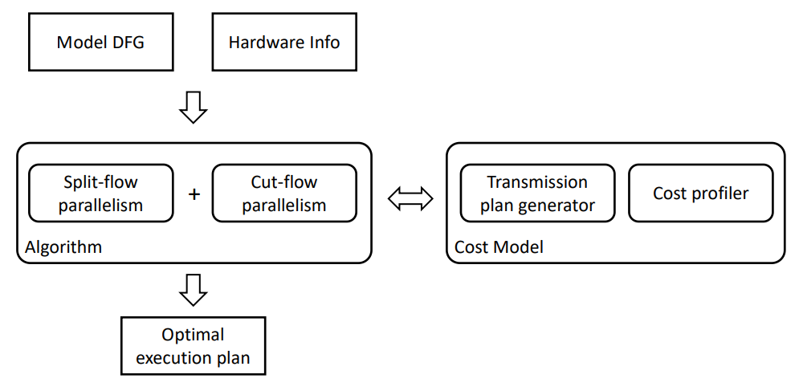

# AutoDist

AutoDist is a package that optimizes for efficient distributed execution plans, given a DL data flow graph and cluster specifications. Compared to [Alpa](https://github.com/alpa-projects/alpa), AutoDist has two main advantages:
- a topology aware dynamic programming solver, which is faster than integer linear programing formulation in most cases
- achieve a balance between memory and time automatically, instead of using a global option

## Prerequisite

```bash
bash ./script/pre_install.sh
```

## Pipeline

<p align="center">
  
</p>
