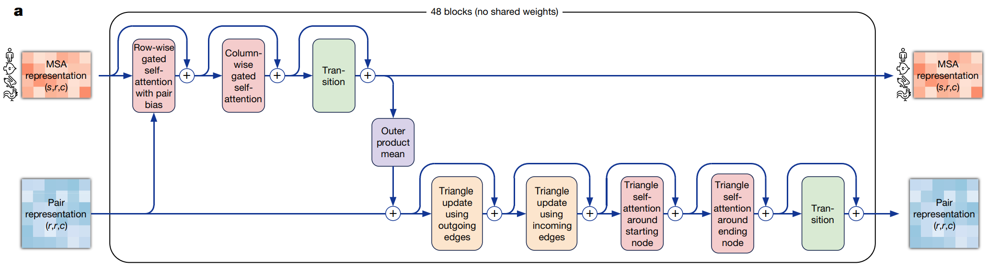

# Introduction

Benchmark different schedule plans of Alphafold2 based on MagicCube.

# Model

## Structure

An evoformer block is composed of 9 sub-modules.

- Row-wise gated self-attention with pair bias & Column-wise gated self-attention -> customized attention module
- MSA transition -> feed forward network
- Outer product mean
- Triangle update using outgoing edges & Triangle update using incoming edges
- Triangle self-attention around starting nodes & Triangle self-attention around ending node -> customized attention module
- Pair transition -> feed forward network

<p align="center">
  
</p>

## Memory Estimation

notation
- $s$: multiple sequence alignment (MSA) number
- $r$: residue number
- $c_{m}$: hidden dimension of MSA representation
- $c_{z}$: hidden dimension of pair representation
- $h$: head number. Different modules may differ

activation
- one Evoformer's output: $s \cdot r \cdot c_{m} + r^{2} \cdot c_{z}$
- Modules' outputs inside a Evoformer block: $3 \cdot s \cdot r \cdot c_{m} + 6 \cdot s \cdot r^{2} \cdot c_{z}$

peak memory
- MSA Row Attention with Bias: $h \cdot s \cdot r^2$, where $h=8$
- MSA Col Attention: $h \cdot s^2 \cdot r$, where $h=8$
- MSA Transition: $4 \cdot s \cdot r \cdot c_{m}$
- Outer Product Mean: $r^2 \cdot c^2$, where $c=32$
- Triangular Multiplicative Update using Outgoing Edges: $r^2 \cdot c$, where $c=128$
- Triangular Multiplicative Update using Ingoing Edges: $r^2 \cdot c$, where $c=128$
- Triangular Gated Self-Attention around Starting Node: $h \cdot r^3$, where $h=4$
- Triangular Gated Self-Attention around Ending Node: $h \cdot r^3$, where $h=4$
- Pair Transition: $4 \cdot r^2 \cdot c_{z}$

parameter
- less than 1M

## Challenge

The core problem is: the evoformer consumes large amount of memory and we need to find the minimal execution time under the accelerator's memory constraint.

According to the estimation above, we find that the memory distribution of evoformer is different from the classical transformer. Using GPT as an example, batch size is 1 in both blocks.

| Model                    | # Parameter | # Activation | # Output |
|:-------------------------|:------------|:-------------|:---------|
| Evoformer (Alphafold2)   | < 1 M       | 5120 M       | 66 M     |
| Transformer (GPT-3 6.7 B)| 192 M       | 512 M        | 8 M      |

Assume the data type is float32 in the following analysis.

If recompute (checkpoint) is not used, the whole memory usage of $n$ evoformer blocks is around $10 \cdot n$ GB.

## Problem Formulation

TODO: try out del tensor in functions that to be recomputed -> offload problems to jit tensor compilers

strategy: detect memory constrained parts then coshard them

large enough size of input shapes already utilize accelerators

should include coshard into the dp formulation

# Experiment

## Usage

**Two steps**

1. change var values in *alphafold2.py*
2. run commands (add *torchrun* to **PATH**)

**Training**

1. Evoformer Stack
    - shape config
        - bs, s, r, cm, cz = 1, 128, 256, 256, 128
        - bs, s, r, cm, cz = 1, 512, 256, 256, 128
        - bs, s, r, cm, cz = 1, 512, 384, 256, 128
    - other config: dtype, evo_num, use_chunk, is_train, is_extra = torch.float16, 4, False, True, False
    - policy
        - spmd.PASSingle
        - spmd.PASDAP

2. Extra Msa Stack
    - shape config
        - bs, s, r, cm, cz = 1, 1024, 256, 64, 128
        - bs, s, r, cm, cz = 1, 1024, 384, 64, 128
        - bs, s, r, cm, cz = 1, 5120, 384, 64, 128
    - other config: dtype, evo_num, use_chunk, is_train, is_extra = torch.float16, 4, True, True, True
    - policy
        - spmd.PASExtraSingle

**Inference**

- shape config: bs, s, r, cm, cz = 1, 128, 2048, 256, 128
- other config: dtype, evo_num, use_chunk, is_train, is_extra = torch.float32, 48, True, False, False
- policy
    - spmd.PASSingleInference
    - spmd.PASDAPInference

**Command**

```bash
torchrun --nproc_per_node=X alphafold2.py
```

X = 1 when *single* in policy. X = 2, 4, 8 when *DAP* in policy.

## Training

Computation in float16

### Evoformer Stack

$48$ Evoformers in total

**s, r = 128, 256**

1 Evoformer output size: $16 + 16 = 32$MB

| device num | policy | peak mem (MB) | activation mem (MB) | time (ms) |
|:-----------|:-------|:--------------|:--------------------|:----------|
| 1          | small  | 8119          | 7462                | 3656.61   |
| 1          | large  | 4414          | 2070                | 3635.38   |
| 2          | small  | 4351          | 4014                | 2539.56   |
| 2          | large  | 2531          | 1318                | 2506.10   |

**s, r = 512, 256**

1 Evoformer output size: $64 + 16 = 80$MB

| device num | policy | peak mem (MB) | activation mem (MB) | time (ms) |
|:-----------|:-------|:--------------|:--------------------|:----------|
| 1          | small  | 18952         | 14471               | 7949.96   |
| 1          | large  | 10729         | 4423                | 7914.68   |
| 2          | small  | 9839          | 7567                | 4839.22   |
| 2          | large  | 5744          | 2543                | 4793.78   |

**s, r = 512, 384**

1 Evoformer output size: $96 + 36 = 132$MB

| device num | policy | peak mem (MB) | activation mem (MB) | time (ms) |
|:-----------|:-------|:--------------|:--------------------|:----------|
| 1          | small  | OOM           | OOM                 | OOM       |
| 1          | large  | 17810         | 7104                | 17063.41  |
| 2          | small  | 16230         | 12847               | 9659.66   |
| 2          | large  | 9416          | 3870                | 9629.48   |

### Extra Msa Stack

$4$ Extra-Evoformer, $c_{m} = 64$ and $c_{z} = 128$

**device num = 1**

| Config           | peak mem (MB) | activation mem (MB) | time (ms) |
|:-----------------|:--------------|:--------------------|:----------|
| s, r = 1024, 256 | 3236          | 1166                | 2306      |
| s, r = 1024, 384 | 6976          | 1805                | 3749.43   |
| s, r = 5120, 384 | 16168         | 8210                | 58393.83  |

## Inference

Computation in float32

### T1044

**s, r = 128, 2048**

| device num | policy      | peak mem (MB) | time (ms) |
|:-----------|:------------|:--------------|:----------|
| 1          | direct      | OOM           | OOM       |
| 1          | chunk       | 23374         | 339742.02 |
| 2          | DAP         | OOM           | OOM       |
| 2          | DAP + chunk | 13006         | 192577.34 |
| 4          | DAP         | OOM           | OOM       |
| 4          | DAP + chunk | 9358          | 101993    |